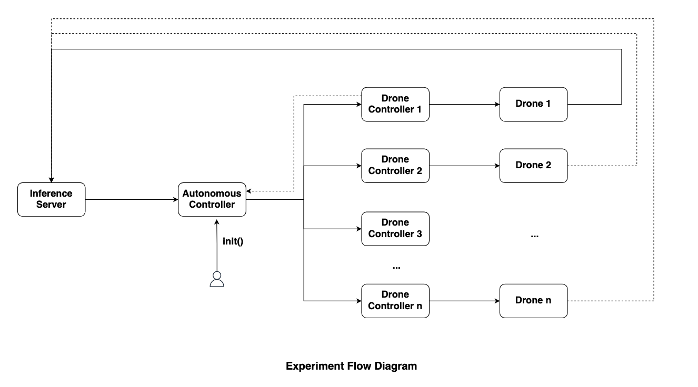
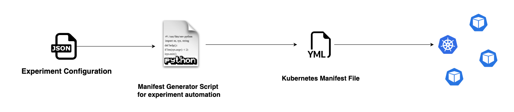

# prowess-dronesim

A simple framework to simulate UAV swarm and distributed inference workloads on the PROWESS testbed.



## Containers

Containers required for the experiment are uploaded to hub.docker.com (user: sred21) and their source files are also available in this repository:

1. drone
2. drone-controller
3. auto-controller
4. edge-server


## Experimentation



```bash

# install pyYAML package
pip install -r requirements.txt

# Run the manifest generation script

python k8s_generator.py arg1 arg2 arg3

```

Scripts arguments:
1. Path to the experiment configuration file (JSON)
2. Name of the experiment
3. Path to file where output YAML manifest is stored (YAML)

Example:

```bash
# For generating a YAML manifest which launches multiple pods
python k8s_generator.py -f config_file -t multipod -o output_file exp_name

# For generating a YAML manifest which creates a single pod with multiple containers
pyton k8s_generator.py -f config_file -t pod -o output_file exp_name

```

## Acknowledgement

This work was funded in part by the NSF AI-EDGE Institute.
